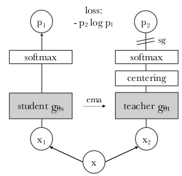

# DINO: self-DIstillation with NO labels
Pytorch implementation of DINO Algorithm proposed by [Caron et al.](https://arxiv.org/abs/2104.14294).





## Requirements
The experiments were performed using Python 3.8.5 with the following Python packages:
- [numpy](http://www.numpy.org/)
- [torch](https://pytorch.org/)
- [torchvision](https://pypi.org/project/torchvision/)
- [pillow](https://pypi.org/project/Pillow/)
- [pathlib](https://pypi.org/project/pathlib/)
- [datatime](https://pypi.org/project/DateTime/)


## Project Structure

```
.
├─ helpers/
│  ├─ utils.py               <- Utility functions and classes
│  ├─ metrics.py             <- To compute accuracy and mAP metric
│  ├─ loss.py                <- To compute DINO loss function
│  └─ load weights.py        <- loading pretrained models
│
├─ Classification/                
│  ├─ eval.py                <- Evaluation function
│  ├─ train.py               <- Train function
│  └─ classifier.py          <- Linear classifier
│
├─ train.py                  <- Training function per epoch
├─ models.py                 <- ViT and DINO architectures
├─ data_augmentation.py      <- data augmentation
├─ main.py                   <- main file
├─ main_classification.py    <- main file for classification task
├─ tinyimagenet.sh           <- To extract imagenet dataset
├─ DINO_head.png          
└─ README.md
```

## Dataset
First, you need the Tiny ImageNet dataset and extract it in the appropriate folder. To do so, run the following script:
```
wget http://cs231n.stanford.edu/tiny-imagenet-200.zip
sh tinyimagenet.sh
```

## Usage
To train DINO model on the previous dataset, set up your configuration (parameters) and run the script as follows:

```
python3 main.py [--data_path DATA_PATH] [--output_dir OUTPUT_DIR] [--saveckp_freq SAVECKP_FREQ] 
                [--seed SEED] [--num_workers NUM_WORKERS] [--weight_decay WEIGHT_DECAY] 
                [--clip_grad CLIP_GRAD] [--batch_size BATCH_SIZE] [--epochs EPOCHS]
                [--lr LR] [--min_lr MIN_LR] [--optimizer {adamw,sgd,lars}]
                [--drop_path_rate DROP_PATH_RATE] [--arch] [--out_dim OUT_DIM]
```

## Classification task
In addition, by adding a simple linear classifier, you can modify your network to be suitable for a classification problem. To train and evaluate the model on ImageNet dataset, run the following script after setting the appropriate parameters:
```
python3 main_classification.py [--data_path DATA_PATH] [--output_dir OUTPUT_DIR] 
                               [--arch ARCH] [--patch_size PATCH_SIZE] 
                               [--epochs EPOCHS] [--lr LR] [--batch_size BATCH_SIZE]
                               [--num_workers NUM_WORKERS] [--val_freq VAL_FREQ] 
                               [--eval] [--num_labels NUM_LABELS]
```

## Acknowledgement
This repo is based mainly on implementation done [here](https://github.com/facebookresearch/dino).
