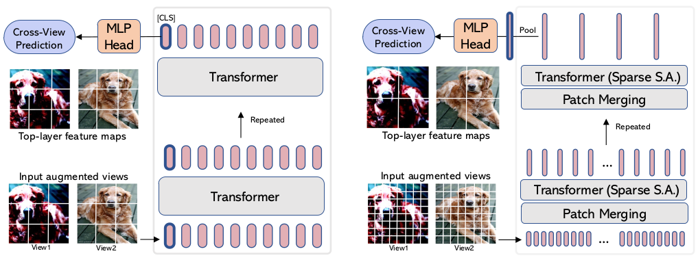

# EsViT: Efficient Self-supervised Vision Transformers
Pytorch implementation of EsViT Algorithm proposed by [Li et al.](https://arxiv.org/abs/2106.09785).





## Requirements


## Project Structure

```
.
├─ ...
├─ architecture.png          
└─ README.md
```

## Dataset


## Usage


## Acknowledgement
This repo is based mainly on implementation done [here](https://github.com/microsoft/esvit).
