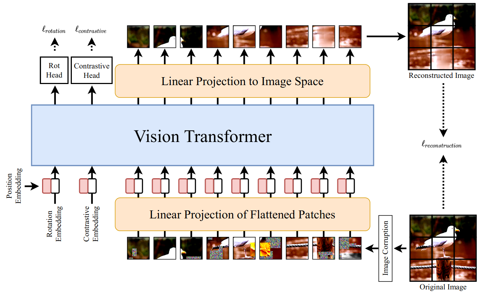

# SiT: Self-Supervised Vision Transformer
Pytorch implementation of [SiT: Self-supervised vIsion Transformer](https://arxiv.org/abs/2104.03602).





## Requirements
The experiments were performed using Python 3.8.5 with the following Python packages:
- [numpy](http://www.numpy.org/)
- [torch](https://pytorch.org/)
- [torchvision](https://pypi.org/project/torchvision/)
- [timm](https://pypi.org/project/timm/)
- [kornia](https://pypi.org/project/kornia/)
- [pandas](https://pypi.org/project/pandas/)
- [imageio](https://pypi.org/project/imageio/)
- [pathlib](https://pypi.org/project/pathlib/)
- [datatime](https://pypi.org/project/DateTime/)


## Project Structure

```
.
├─ datasets/
│  ├─ utils.py               <- Utility functions and classes for dataloading
│  ├─ transforms.py          <- For data augmentation
│  ├─ eval_transforms.py     <- Transformations applied in evaluation mode
│  ├─ TinyImageNet.py        <- class for Tiny ImageNet dataset
│  └─ prepare_data.py        <- prepare and build the dataset
│
├─ model/                
│  ├─ layers.py              <- some modules to build the whole model
│  └─ network.py             <- SiT architecture
│
├─ utils.py                  <- Utility functions and classes
├─ losses.py                 <- compute multi-task loss function
├─ eval.py                   <- Evaluation function
├─ train.py                  <- training function
├─ main.py                   <- main file
├─ tinyimagenet.sh           <- To extract data
├─ architecture.png          
└─ README.md
```

## Dataset
First, you need the Tiny ImageNet dataset and extract it in the appropriate folder. To do so, run the following script:
```
wget http://cs231n.stanford.edu/tiny-imagenet-200.zip
sh tinyimagenet.sh
```

## Usage
To train SiT model on the previous dataset, set up your configuration (parameters) and run the script as follows:

```
python3 main.py [--dataset_location DATASET_LOCATION] [--ratio RATIO] [--seed SEED]
                [--batch_size BATCH_SIZE] [--num_workers NUM_WORKERS] [--device DEVICE] 
                [--start_epoch START_EPOCH] [--epochs EPOCHS] [--resume RESUME]  
                [--output_dir OUTPUT_DIR] [--eval] [--val_step VAL_STEP] 
                [--training_mode TRAINING_MODE] [--input_size INPUT_SIZE] [--lr LR]
```

For evaluation, you could simply set the `eval` parameter and then run the `main.py` file.

## Acknowledgement
This repo is based mainly on implementation done [here](https://github.com/Sara-Ahmed/SiT).
