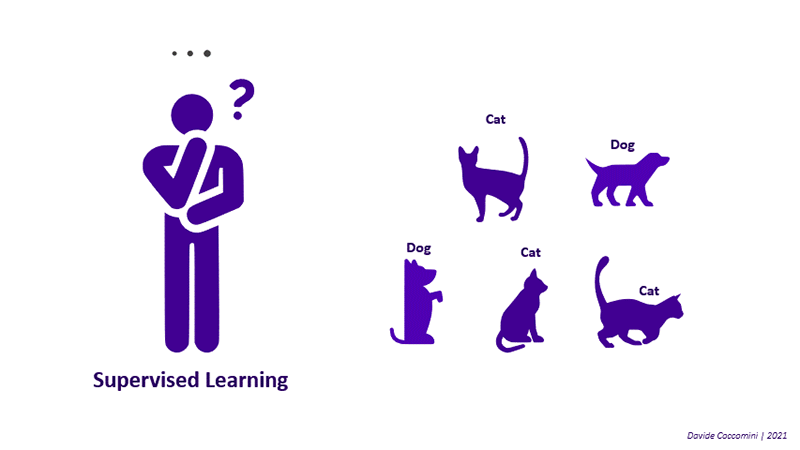

# Transformer-based-Self-supervised-Learning
Pytorch implementation of several transformer-based networks which learn in a self-supervised manner.



## Introduction

## Organization

```
.
├─ SiT/                      <- Implementation of Self-supervised vIsion Transformer
│  └─ ...   
│
├─ DINO/                      <- Implementation of self-DIstillation with NO labels
│  └─ ...      
│
├─ SSL.gif          
└─ README.md
```


## References
1. [SiT: Self-supervised vIsion Transformer](https://arxiv.org/abs/2104.03602)
2. [Emerging Properties in Self-Supervised Vision Transformers](https://arxiv.org/abs/2104.14294)
